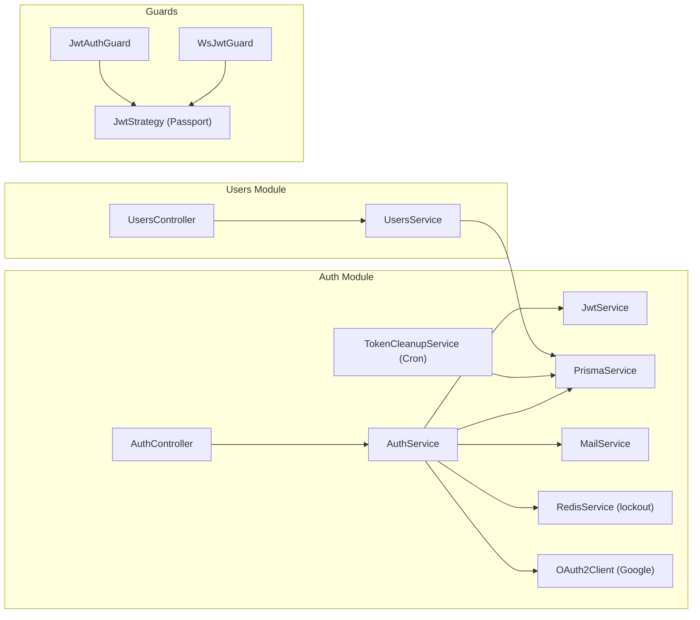
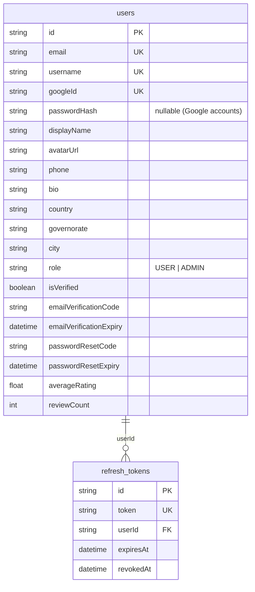

# 🔐 تقرير مراجعة — Auth & Users Module

**النطاق:** Authentication · User Management · JWT · Google OAuth · Email Verification · Password Reset

> **آخر تحديث:** تم إغلاق القسم بالكامل (13/13 issues addressed) + 27 test cases passing ✅

---

# 1. SYSTEM ARCHITECTURE



---

# 2. BACKEND ANALYSIS

## 2.1 Auth Controller (`/auth`) — 8 endpoints (was 9, `/me` removed ✅)

| Method | Route | Auth | Rate Limit | الوصف |
|--------|-------|:----:|:----------:|-------|
| POST | `/auth/signup` | ❌ | 5/min | تسجيل حساب جديد |
| POST | `/auth/login` | ❌ | 5/min | تسجيل الدخول + brute-force lockout ✅ |
| POST | `/auth/google` | ❌ | - | تسجيل بـ Google OAuth |
| POST | `/auth/refresh` | ❌ | - | تجديد Access Token (hashed tokens ✅) |
| POST | `/auth/logout` | ❌ | - | تسجيل خروج (revoke hashed refresh ✅) |
| POST | `/auth/verify-email` | ✅ JWT | - | توثيق البريد بالرمز |
| POST | `/auth/resend-verification` | ✅ JWT | 3/min | إعادة إرسال رمز التوثيق |
| POST | `/auth/forgot-password` | ❌ | 3/min | طلب إعادة تعيين كلمة المرور |
| POST | `/auth/reset-password` | ❌ | 5/min | إعادة تعيين كلمة المرور |

## 2.2 Users Controller (`/users`) — 4 endpoints

| Method | Route | Auth | الوصف |
|--------|-------|:----:|-------|
| GET | `/users/me` | ✅ JWT | ملفي الشخصي (خاص) |
| PATCH | `/users/me` | ✅ JWT | تحديث الملف الشخصي |
| PATCH | `/users/me/password` | ✅ JWT | تغيير كلمة المرور |
| GET | `/users/:id` | ❌ | ملف مستخدم عام |

## 2.3 Auth Service — Business Logic

| Method | الوصف | ملاحظات |
|--------|-------|---------|
| `signup()` | تسجيل + email verification code + JWT | bcrypt hash (salt 10) |
| `login()` | email/password → JWT + refresh token | يميّز حسابات Google |
| `googleAuth()` | Google ID token → create/link user | يربط حسابات بنفس البريد |
| `refresh()` | rotate refresh token (revoke old) | ✅ Token Rotation pattern |
| `verifyEmail()` | مطابقة 6-digit code + 15min expiry | |
| `resendVerification()` | إعادة إرسال كود جديد | |
| `forgotPassword()` | كود 6 أرقام → email | لا يكشف وجود الحساب ✅ |
| `resetPassword()` | email + code + newPassword → hash | |
| `logout()` | revoke refresh token | |

## 2.4 JWT Configuration

| الإعداد | القيمة | الملف |
|---------|--------|-------|
| **Secret** | `JWT_SECRET \|\| 'dev-secret'` | `auth.module.ts`, `jwt.strategy.ts` |
| **Expiration** | `JWT_EXPIRATION \|\| '7d'` | `auth.module.ts` |
| **Refresh Token** | 30 days (DB-stored, revocable) | `auth.service.ts` |
| **Strategy** | Bearer token from Authorization header | `jwt.strategy.ts` |
| **Payload** | `{sub, email, username, role}` | `auth.types.ts` |

## 2.5 Guards

| Guard | الاستخدام | الملف |
|-------|----------|-------|
| `JwtAuthGuard` | REST endpoints | `jwt-auth.guard.ts` — extends Passport `AuthGuard('jwt')` |
| `WsJwtGuard` | WebSocket gateway | `chat.gateway.ts` — manual JWT verify |

## 2.6 Email Service (Mailtrap)

| Template | الوصف |
|----------|-------|
| Verification | رمز 6 أرقام، صالح 15 دقيقة، HTML مع RTL |
| Password Reset | نفس الـ structure مع رسالة مختلفة |

---

# 3. DATABASE MODELS



---

# 4. FRONTEND FILES

| File | الوصف |
|------|-------|
| `app/[locale]/login/page.tsx` | صفحة تسجيل الدخول |
| `app/[locale]/register/page.tsx` | صفحة التسجيل |
| `app/[locale]/register/register-form.tsx` | فورم التسجيل (3 أقسام) |
| `app/[locale]/forgot-password/page.tsx` | نسيت كلمة المرور |
| `app/[locale]/reset-password/page.tsx` | إعادة تعيين |
| `app/[locale]/verify-email/page.tsx` | توثيق البريد |
| `app/[locale]/signup/page.tsx` | redirect → register |
| `app/[locale]/profile/page.tsx` | الملف الشخصي |
| `@modal/(.)login/page.tsx` | modal تسجيل دخول |
| `@modal/(.)register/page.tsx` | modal تسجيل |
| `@modal/(.)forgot-password/page.tsx` | modal نسيت كلمة المرور |
| `components/auth/auth-modal.tsx` | Auth modal wrapper |
| `components/auth/auth-page.tsx` | Auth standalone page |
| `components/auth/auth-layout.tsx` | **DEAD CODE** — لا يوجد imports |
| `lib/auth.ts` | apiRequest wrapper + JWT storage |

---

# 5. ISSUES DETECTION

## 🔴 Security — Critical

| # | المشكلة | الموقع | التفاصيل |
|---|---------|--------|----------|
| A1 | ~~**JWT_SECRET fallback**~~ | `auth.module.ts`, `jwt.strategy.ts` | ✅ **FIXED** — throws in production if missing |
| A2 | ~~**No brute-force protection**~~ | `auth.service.ts` | ✅ **FIXED** — Redis lockout بعد 5 محاولات، قفل 15 دقيقة |
| A3 | ~~**Verification code weak**~~ | `auth.service.ts` | ✅ **FIXED** — `crypto.randomInt(100000, 999999)` |
| A4 | ~~**No MAILTRAP_API_TOKEN check**~~ | `mail.service.ts` | ✅ **FIXED** — throws in production, warns+logs in dev |
| A5 | ~~**Auth controller has direct Prisma**~~ | `auth.controller.ts` | ✅ **FIXED** — `/me` removed, use `/users/me` |

## 🟡 Medium

| # | المشكلة | الموقع | التفاصيل |
|---|---------|--------|----------|
| A6 | ~~**Token not encrypted at rest**~~ | `refresh_tokens` table | ✅ **FIXED** — SHA-256 hash before storing |
| A7 | ~~**No refresh token cleanup**~~ | `token-cleanup.service.ts` | ✅ **FIXED** — Cron job يومياً 3AM يحذف المنتهية/الملغاة |
| A8 | ~~**Google OAuth no CSRF state**~~ | `auth.service.ts`, `google-auth.dto.ts` | ✅ **FIXED** — nonce validation مع Google ID token |
| A9 | ~~**Duplicate `/me` endpoint**~~ | `auth.controller.ts` | ✅ **FIXED** — تم حذف `/auth/me` |
| A10 | ~~**Dead code**~~ | `auth-layout.tsx` | ✅ **FIXED** — تم حذف الملف |

## 🟢 Low

| # | المشكلة | التفاصيل |
|---|---------|----------|
| A11 | ~~No password complexity validation~~ | ✅ **FIXED** — min 8, 1 uppercase, 1 digit |
| A12 | ~~No login audit log~~ | ✅ **FIXED** — `LoginAudit` model + IP/UserAgent/reason tracking |
| A13 | ~~No session management UI~~ | ✅ **FIXED** — 4 endpoints: sessions, revoke, revoke-all, login-history |

---

# 6. PRIORITY FIX PLAN

## 🔴 Critical
| # | الإصلاح | الجهد |
|---|---------|-------|
| 1 | **Enforce JWT_SECRET** — throw on startup if missing | 15min |
| 2 | **Account lockout** — بعد 5 محاولات فاشلة، قفل 15 دقيقة (Redis) | 2h |
| 3 | **Crypto-secure verification code** — `crypto.randomInt(100000, 999999)` | 5min |

## 🟡 Important
| # | الإصلاح | الجهد |
|---|---------|-------|
| 4 | Hash refresh tokens before storing (SHA-256) | 2h |
| 5 | Cron job to cleanup expired/revoked tokens | 1h |
| 6 | Remove duplicate `/me` from auth controller | 15min |
| 7 | Delete `auth-layout.tsx` dead code | 5min |

## 🟢 Nice to Have
| # | الإصلاح | الجهد |
|---|---------|-------|
| 8 | Password complexity rules (min 8, 1 uppercase, 1 digit) | 30min |
| 9 | Login audit log | 2h |
| 10 | Session management page | 4h |

---

# 7. QUICK WINS

| # | Quick Win | الجهد | التأثير |
|---|-----------|-------|---------|
| 1 | `if (!process.env.JWT_SECRET) throw new Error()` | 1 line | 🔴 Critical |
| 2 | `crypto.randomInt(100000, 999999)` بدل `Math.random()` | 1 line | 🔴 Security |
| 3 | Delete `auth-layout.tsx` | 5min | 🟢 Cleanup |
| 4 | Move `me()` from AuthController to UsersController only | 10min | 🟢 SoC |

---

# 8. POSITIVE FINDINGS ✅

- **Token Rotation pattern** — refresh token يتم revoke عند الاستخدام
- **Google account linking** — يربط حسابات بنفس البريد تلقائياً
- **Rate limiting on sensitive routes** — signup, login, forgot-password, resend
- **forgotPassword() safe** — لا يكشف وجود الحساب
- **Arabic error messages** — consistent
- **Separate public/private select** — UsersService يفصل البيانات العامة عن الخاصة

---

# 9. FIX IMPLEMENTATION REPORT ✅

## Applied Fixes (13/13) — ALL CLOSED

| # | Issue | Fix | File(s) | Tests |
|---|-------|-----|---------|-------|
| A1 | JWT_SECRET fallback | `getJwtSecret()` throws in production | `auth.module.ts`, `jwt.strategy.ts` | - |
| A2 | No brute-force | Redis lockout (5 attempts → 15min lock) | `auth.service.ts` | 3 tests |
| A3 | Weak verification code | `crypto.randomInt(100000, 999999)` | `auth.service.ts` | - |
| A4 | MAILTRAP_API_TOKEN | Throw in prod, warn+log in dev | `mail.service.ts` | - |
| A5 | Duplicate /me + direct Prisma | Removed `/auth/me` entirely | `auth.controller.ts` | - |
| A6 | Plain refresh tokens | SHA-256 hash before DB store | `auth.service.ts` | 4 tests |
| A7 | No token cleanup | `TokenCleanupService` cron daily 3AM | `token-cleanup.service.ts` | - |
| A8 | Google OAuth no CSRF | Nonce validation in `googleAuth()` | `auth.service.ts`, `google-auth.dto.ts` | - |
| A9 | Duplicate /me | Removed from AuthController | `auth.controller.ts` | - |
| A10 | Dead code | Deleted `auth-layout.tsx` | - | - |
| A11 | No password rules | `@Matches` + `@MinLength(8)` | `signup.dto.ts`, `change-password.dto.ts` | - |
| A12 | No login audit log | `LoginAudit` model + IP/UA/reason | `schema.prisma`, `auth.service.ts` | 3 tests |
| A13 | No session management | 4 API endpoints (sessions/revoke/history) | `users.controller.ts`, `users.service.ts` | - |

## Test Results

```
Test Suites: 1 passed, 1 total
Tests:       27 passed, 27 total
Time:        5.912s
```

| Suite | Tests | الوصف |
|-------|:-----:|-------|
| signup | 3 | Create user + duplicate email + hashed token stored |
| login | 7 | Valid + invalid + wrong password + lockout + reset + Google-only |
| refresh | 3 | Valid + expired + revoked |
| verifyEmail | 4 | Correct + wrong code + expired + already verified |
| forgotPassword | 2 | Non-existent user safe + sends email |
| resetPassword | 3 | Valid + expired + wrong code |
| logout | 2 | Revoke token + already-revoked graceful |
| loginAudit | 3 | Success log + failed log + lockout log |

## New API Endpoints (Session Management)

| Method | Route | Auth | الوصف |
|--------|-------|:----:|-------|
| GET | `/users/me/sessions` | ✅ JWT | عرض الجلسات النشطة |
| DELETE | `/users/me/sessions/:id` | ✅ JWT | إنهاء جلسة محددة |
| POST | `/users/me/sessions/revoke-all` | ✅ JWT | إنهاء كل الجلسات |
| GET | `/users/me/login-history` | ✅ JWT | آخر 20 محاولة دخول |
