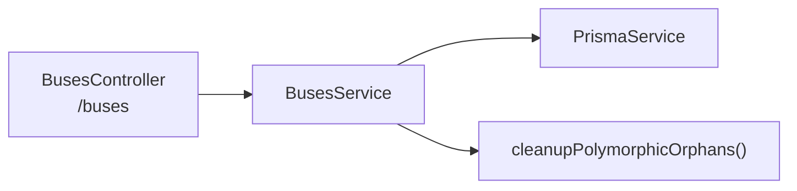
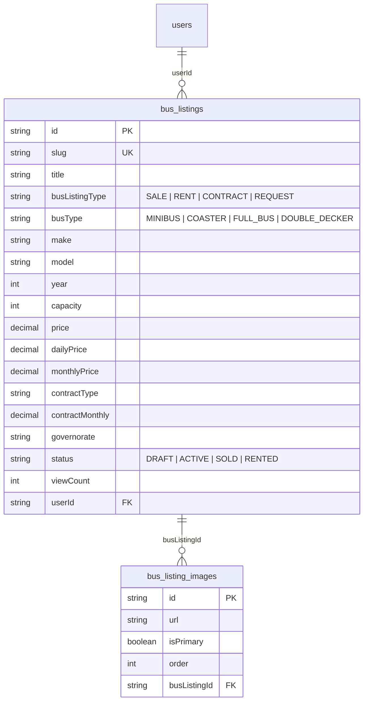

# 🚌 تقرير مراجعة — Buses Module

**النطاق:** Bus Listings (بيع · إيجار · عقود · طلب حافلات) · Bus Images

---

# 1. ARCHITECTURE

**ملاحظة:** الحافلات **لا** تستخدم Redis Cache ولا Meilisearch ولا Notifications.

---

# 2. BACKEND ANALYSIS

## 2.1 Buses Controller (`/buses`) — 9 endpoints

| Method | Route | Auth | الوصف |
|--------|-------|:----:|-------|
| POST | `/buses` | ✅ | إنشاء إعلان حافلة |
| GET | `/buses` | ❌ | تصفح (paginated + filtered) |
| GET | `/buses/my` | ✅ | إعلاناتي |
| GET | `/buses/slug/:slug` | ❌ | بالـ slug |
| GET | `/buses/:id` | ❌ | تفاصيل |
| PATCH | `/buses/:id` | ✅ | تحديث (owner) |
| DELETE | `/buses/:id` | ✅ | حذف (owner) |
| POST | `/buses/:id/images` | ✅ | إضافة صور (batch URLs) |
| DELETE | `/buses/images/:imageId` | ✅ | حذف صورة |

## 2.2 Service Layer

| الجانب | التقييم |
|--------|---------|
| **Repository** | ❌ Direct Prisma |
| **Redis Cache** | ❌ لا يوجد |
| **Meilisearch** | ❌ لا يوجد — `ILIKE` فقط |
| **Notifications** | ❌ لا يرسل إشعارات |
| **Pagination** | ✅ `findAll()` مع page + limit (max 50) |
| **Authorization** | ✅ owner check |
| **Slug generation** | ✅ مع timestamp suffix |
| **Image management** | ✅ add/remove مع isPrimary + order |
| **Orphan cleanup** | ✅ عند الحذف |

## 2.3 Listing Types

إعلانات الحافلات تدعم 4 أنواع عبر `busListingType`:

| النوع | الوصف | الحقول الخاصة |
|-------|-------|---------------|
| `SALE` | بيع حافلة | price, isPriceNegotiable |
| `RENT` | إيجار حافلة | dailyPrice, monthlyPrice, minRentalDays, withDriver |
| `CONTRACT` | عقد تشغيل | contractType, contractClient, contractMonthly, contractDuration, contractExpiry |
| `REQUEST` | طلب حافلة | requestPassengers, requestRoute, requestSchedule |

## 2.4 Filters

| Filter | الحقل |
|--------|-------|
| `search` | title, description, make (`ILIKE`) |
| `busListingType` | exact |
| `busType` | exact |
| `make` | `ILIKE` |
| `governorate` | exact |
| `minPrice` / `maxPrice` | range |
| `minCapacity` / `maxCapacity` | range |
| `sort` | `price_asc`, `price_desc`, default: `createdAt desc` |

---

# 3. DATABASE MODEL

---

# 4. FRONTEND FILES

| File | الوصف |
|------|-------|
| `app/[locale]/buses/[id]/page.tsx` | تفاصيل حافلة |
| `app/[locale]/add-listing/bus/page.tsx` | إضافة إعلان حافلة |

---

# 5. ISSUES DETECTION

## 🔴 Critical

| # | المشكلة | الموقع | التفاصيل |
|---|---------|--------|----------|
| B1 | **viewCount manipulation** | `buses.service.ts:147,161` | يزيد مع كل `findOne()` و `findBySlug()` بدون rate-limit |
| B2 | **No update DTO** | `buses.controller.ts:47` | يستخدم `Partial<CreateBusListingDto>` — لا يمنع تغيير حقول محظورة |
| B3 | **myListings() without pagination** | `buses.service.ts:165` | يرجع كل الإعلانات بدون limit |

## 🟡 Medium

| # | المشكلة | الموقع | التفاصيل |
|---|---------|--------|----------|
| B4 | **No Meilisearch** | - | بحث `ILIKE` فقط |
| B5 | **No Redis cache** | - | كل request يضرب DB |
| B6 | **No notifications** | - | لا يُرسل إشعار عند أي event |
| B7 | **Image creation not transactional** | `buses.service.ts:246` | `Promise.all(map)` — لو فشل واحد ينجح الباقي |
| B8 | **Manual field mapping** | `buses.service.ts:179-214` | **36 lines** من `if (dto.x !== undefined)` |
| B9 | **Duplicated generateSlug()** | `buses.service.ts:20` | نسخة مكررة |
| B10 | **Duplicated SELLER_SELECT** | `buses.service.ts:11` | نفس الثابت في 4+ services |

---

# 6. PRIORITY FIX PLAN

| Priority | # | الإصلاح | الجهد |
|----------|---|---------|-------|
| 🔴 | 1 | viewCount rate-limit (Redis INCR) | 2h |
| 🔴 | 2 | Create proper `UpdateBusListingDto` | 30min |
| 🔴 | 3 | Pagination for myListings() | 15min |
| 🟡 | 4 | Meilisearch index for buses | 3h |
| 🟡 | 5 | Redis cache (5min TTL) | 2h |
| 🟡 | 6 | Batch image creation in `$transaction` | 30min |
| 🟢 | 7 | Extract shared generateSlug + SELLER_SELECT | 30min |

---

# 7. POSITIVE FINDINGS ✅

- **Rich listing types** — 4 أنواع (بيع، إيجار، عقود، طلبات) بحقول مخصصة لكل نوع
- **Image management** — isPrimary + order + add/remove
- **Orphan cleanup** — عند الحذف
- **Comprehensive filters** — price range, capacity range, bus type, listing type
