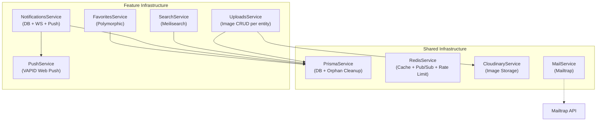
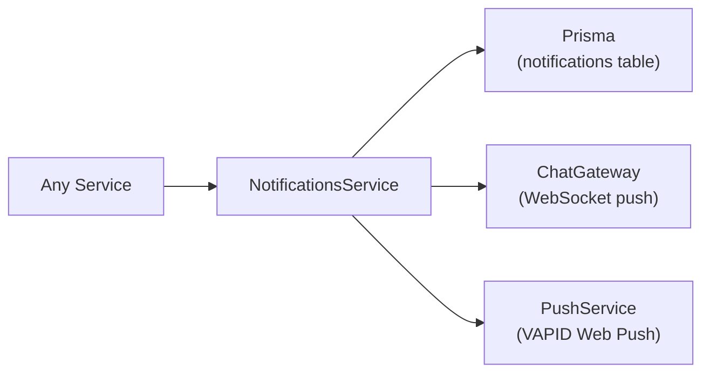

# ⚙️ تقرير مراجعة — Infrastructure Modules

**النطاق:** Search · Uploads · Favorites · Notifications · Redis · Prisma · Mail · Cloudinary

---

# 1. ARCHITECTURE OVERVIEW

---

# 2. SEARCH MODULE

## 2.1 Configuration

| الإعداد | القيمة |
|---------|--------|
| **Client** | Meilisearch 1.12 (ESM-only, injected via custom provider) |
| **Indexes** | `listings`, `parts`, `transport`, `trips`, `insurance`, `services` |
| **❌ Missing** | `buses`, `equipment`, `jobs` — 3 modules بدون Meilisearch |

## 2.2 Features

| Feature | التفاصيل |
|---------|----------|
| **Multi-index search** | يبحث في 6 indexes دفعة واحدة |
| **Autocomplete** | اقتراحات خفيفة (8 نتائج، deduplicated) |
| **Filters** | price range, governorate, city, make, condition, listingType, category |
| **Sorting** | price asc/desc, newest (createdAt) |
| **Highlighting** | `<mark>` tags on title + description |
| **Typo tolerance** | 1 typo at 3 chars, 2 typos at 6 chars |
| **Arabic synonyms** | Custom synonyms map via `buildSynonymsMap()` |
| **Reindex all** | Full sync from PostgreSQL for all 6 indexes |

## 2.3 Search Controller (`/search`)

| Method | Route | Auth | الوصف |
|--------|-------|:----:|-------|
| GET | `/search` | ❌ | بحث متعدد الـ indexes |
| GET | `/search/autocomplete` | ❌ | اقتراحات |
| POST | `/search/reindex` | ✅ Admin | إعادة فهرسة كاملة |

## 2.4 Issues

| # | المشكلة | الخطورة | التفاصيل |
|---|---------|---------|----------|
| SR1 | **3 modules missing** | 🟡 | Buses, Equipment, Jobs لا يُفهرسون |
| SR2 | **reindexAll() loads all data to memory** | 🟡 | مع 100K listings يمكن أن يسبب OOM |
| SR3 | **Multi-index merge loses ranking** | 🟢 | النتائج من indexes مختلفة تُدمج بدون re-ranking |
| SR4 | **No admin-only guard on reindex** | 🔴 | أي authenticated user يقدر يعمل reindex |
| SR5 | **Category filter uses OR** | 🟢 | `(partCategory = x OR transportType = x OR ...)` — ممكن false positives |

---

# 3. UPLOADS MODULE

## 3.1 Controller (`/uploads`) — 9 endpoints

| Method | Route | Auth | الوصف |
|--------|-------|:----:|-------|
| POST | `/uploads` | ✅ | رفع ملف واحد |
| POST | `/uploads/multiple` | ✅ | رفع حتى 10 ملفات |
| GET | `/uploads/listings/:id/images` | ❌ | صور إعلان |
| POST | `/uploads/listings/:id/images` | ✅ | رفع + ربط بإعلان |
| POST | `/uploads/listings/:id/images/url` | ✅ | ربط URL موجود |
| DELETE | `/uploads/listings/:id/images/:imgId` | ✅ | حذف صورة إعلان |
| PATCH | `/uploads/listings/:id/images/reorder` | ✅ | إعادة ترتيب |
| POST | `/uploads/parts/:id/images` | ✅ | صورة قطعة غيار |
| POST | `/uploads/services/:id/images` | ✅ | صورة خدمة |
| POST | `/uploads/buses/:id/images` | ✅ | صورة حافلة |
| POST | `/uploads/transport/:id/images` | ✅ | صورة نقل |
| POST | `/uploads/equipment/:id/images` | ✅ | صورة معدة |

## 3.2 Cloudinary Configuration

| الإعداد | القيمة |
|---------|--------|
| **Max file size** | 10 MB |
| **Max batch** | 10 files |
| **Folder** | `carone/` |
| **Transform** | auto-quality + auto-format |
| **Resource type** | `image` only |

## 3.3 Issues

| # | المشكلة | الخطورة | التفاصيل |
|---|---------|---------|----------|
| UP1 | **No file type validation** | 🔴 | أي ملف يُرفع — لا يتحقق من MIME type أو extension |
| UP2 | **No image dimensions limit** | 🟡 | 10MB من صورة 10000x10000px تُقبل |
| UP3 | **Cloudinary keys not validated** | 🟡 | لو فارغة، الرفع يفشل بصمت |
| UP4 | **6 entity-specific upload methods** | 🟢 | Code duplication — نفس الـ pattern مكرر |
| UP5 | **No cleanup of orphaned Cloudinary files** | 🟡 | لو تم حذف كيان، الصور تبقى في Cloudinary |

---

# 4. FAVORITES MODULE

## 4.1 Controller (`/favorites`) — 4 endpoints

| Method | Route | Auth | الوصف |
|--------|-------|:----:|-------|
| POST | `/favorites/toggle` | ✅ | إضافة/إزالة من المفضلة |
| GET | `/favorites` | ✅ | مفضلاتي (paginated) |
| GET | `/favorites/check` | ✅ | هل عنصر في المفضلة؟ |
| GET | `/favorites/ids` | ✅ | كل IDs المفضلة |

## 4.2 Supported Entity Types

| entityType | الكيان |
|------------|-------|
| `LISTING` | سيارات |
| `JOB` | وظائف |
| `SPARE_PART` | قطع غيار |
| `CAR_SERVICE` | خدمات |
| `TRANSPORT` | نقل |
| `TRIP` | رحلات |
| `INSURANCE` | تأمين |

**❌ Missing:** `BUS_LISTING`, `EQUIPMENT_LISTING`, `OPERATOR_LISTING`

## 4.3 Issues

| # | المشكلة | الخطورة | التفاصيل |
|---|---------|---------|----------|
| FV1 | **N+1 for non-listing favorites** | 🟡 | `getUserFavorites()` → `Promise.all(map(resolveEntity))` |
| FV2 | **3 entity types missing** | 🟡 | Buses, Equipment, Operators لا يُدعمون |
| FV3 | **Notification only for LISTING** | 🟢 | باقي الأنواع لا ترسل إشعار |
| FV4 | **resolveEntityTitle() duplicates chat logic** | 🟢 | نفس switch في `chat.service.ts` |

---

# 5. NOTIFICATIONS MODULE

## 5.1 Architecture

## 5.2 Controller (`/notifications`) — 5 endpoints

| Method | Route | Auth | الوصف |
|--------|-------|:----:|-------|
| GET | `/notifications` | ✅ | إشعاراتي (paginated) |
| GET | `/notifications/unread-count` | ✅ | عدد غير المقروءة |
| PATCH | `/notifications/:id/read` | ✅ | تحديد كمقروء |
| PATCH | `/notifications/read-all` | ✅ | تحديد الكل كمقروء |
| POST | `/notifications/push/subscribe` | ✅ | اشتراك Web Push |
| DELETE | `/notifications/push/subscribe` | ✅ | إلغاء اشتراك |

## 5.3 Notification Types (used across modules)

| Type | الوصف | المرسل |
|------|-------|--------|
| `LISTING_FAVORITED` | إعلانك أُعجب به | FavoritesService |
| `BOOKING_REQUEST` | حجز جديد | BookingsService |
| `BOOKING_CONFIRMED` | حجز مؤكد | BookingsService |
| `BOOKING_CANCELLED` | حجز ملغي | BookingsService |
| `JOB_APPLICATION` | طلب توظيف | JobsService |
| `JOB_APPLICATION_ACCEPTED` | قبول طلب | JobsService |
| `JOB_APPLICATION_REJECTED` | رفض طلب | JobsService |
| `REVIEW_RECEIVED` | تقييم جديد | ReviewsService |
| `PAYMENT_SUCCESS` | دفع ناجح | PaymentsService |
| `PAYMENT_FAILED` | دفع فاشل | PaymentsService |

## 5.4 Issues

| # | المشكلة | الخطورة | التفاصيل |
|---|---------|---------|----------|
| NT1 | **Silent failure** | 🟡 | `try { gateway.sendNotification() } catch {}` — لو فشل الـ WS، لا يسجل |
| NT2 | **No notification cleanup** | 🟢 | الإشعارات تتراكم بلا حذف تلقائي |
| NT3 | **forwardRef coupling** | 🟡 | `@Inject(forwardRef(() => ChatGateway))` — circular dependency |
| NT4 | **VAPID keys not validated** | 🟡 | لو فارغة، Push يفشل بصمت مع warning فقط |

---

# 6. REDIS MODULE

## 6.1 Service Methods

| Method | الوصف | الاستخدام |
|--------|-------|----------|
| `get<T>() / set()` | Cache operations | Listings cache |
| `del() / delPattern()` | Cache invalidation | On CRUD |
| `exists()` | Key existence check | Bid cooldowns |
| `incr()` | Atomic counter + TTL | Bid rate limiting |
| `setNX()` | Set if not exists | Cooldowns |
| `getTTL()` | Remaining TTL | Cooldown info |
| `publish() / subscribe()` | Pub/Sub | Chat messages |
| `getPublisher() / getSubscriber()` | Raw clients | Socket.IO adapter |

## 6.2 Connection Architecture

- **3 separate connections:** client, publisher, subscriber
- **Graceful fallback:** `connected = false` → all methods return null/0/false
- **Retry strategy:** max 5 retries, exponential backoff (200ms-2s)

## 6.3 Issues

| # | المشكلة | الخطورة | التفاصيل |
|---|---------|---------|----------|
| RD1 | **`delPattern()` uses KEYS** | 🔴 | `KEYS *` blocks Redis — يجب استخدام `SCAN` |
| RD2 | **console.log for errors** | 🟡 | يستخدم `console.error` بدل `Logger` |
| RD3 | **REDIS_URL logged partially** | 🟡 | `redisUrl?.substring(0, 20)` — ممكن يكشف بيانات |
| RD4 | **Empty catch blocks** | 🟡 | الأخطاء تُبتلع بصمت |
| RD5 | **No health check endpoint** | 🟢 | لا يوجد `/health/redis` |

---

# 7. PRISMA MODULE

## 7.1 PrismaService

| Feature | التفاصيل |
|---------|----------|
| **Lifecycle** | `OnModuleInit` (connect) + `OnModuleDestroy` (disconnect) |
| **Utility** | `cleanupPolymorphicOrphans(entityType, entityId)` — transactional cleanup |

## 7.2 Schema Stats

| الإحصائية | القيمة |
|-----------|--------|
| **Total lines** | 1528 |
| **Models** | ~30 |
| **Enums** | ~20 |
| **Image tables** | 6 (مكررة) |
| **Polymorphic entities** | conversations, favorites, reviews, payments |

## 7.3 Issues

| # | المشكلة | الخطورة | التفاصيل |
|---|---------|---------|----------|
| PR1 | **No connection pool config** | 🟡 | Prisma default — يحتاج `connection_limit` في production |
| PR2 | **No query logging** | 🟢 | لا يسجل slow queries |
| PR3 | **cleanupPolymorphicOrphans silent failure** | 🟢 | يسجل error لكن لا يعيد throw |

---

# 8. MAIL MODULE

## 8.1 MailService

| Feature | التفاصيل |
|---------|----------|
| **Provider** | Mailtrap API |
| **From** | `hello@demomailtrap.co` → `كار وان` |
| **Templates** | Verification + Password Reset (inline HTML) |
| **Language** | RTL Arabic |
| **Expiry** | 15 minutes |

## 8.2 Issues

| # | المشكلة | الخطورة | التفاصيل |
|---|---------|---------|----------|
| ML1 | **Demo email domain** | 🔴 | `demomailtrap.co` — production يحتاج custom domain |
| ML2 | **Inline HTML templates** | 🟡 | Templates مدمجة في الكود — يصعب صيانتها |
| ML3 | **Silent failure** | 🟡 | Email يفشل بصمت — المستخدم لا يعرف |
| ML4 | **No email queue** | 🟢 | يُرسل synchronously — ممكن يبطّئ الـ signup |

---

# 9. COMBINED PRIORITY FIX PLAN

## 🔴 Critical

| # | الإصلاح | Module | الجهد |
|---|---------|--------|-------|
| 1 | **Replace KEYS with SCAN** in `delPattern()` | Redis | 1h |
| 2 | **File type validation** in uploads | Uploads | 1h |
| 3 | **Admin guard on reindex** | Search | 15min |
| 4 | **Production email domain** | Mail | Config change |

## 🟡 Important

| # | الإصلاح | Module | الجهد |
|---|---------|--------|-------|
| 5 | Add Meilisearch for Buses, Equipment, Jobs | Search | 4h |
| 6 | Add missing entity types to Favorites | Favorites | 1h |
| 7 | Fix N+1 in getUserFavorites() | Favorites | 2h |
| 8 | Batch reindex with cursor pagination | Search | 2h |
| 9 | Replace console.log with Logger | Redis | 30min |
| 10 | Connection pool config for Prisma | Prisma | 15min |

## 🟢 Nice to Have

| # | الإصلاح | Module | الجهد |
|---|---------|--------|-------|
| 11 | HTML email templates (external files) | Mail | 3h |
| 12 | Email queue (Bull) | Mail | 2h |
| 13 | Notification cleanup cron | Notifications | 1h |
| 14 | Redis health endpoint | Redis | 30min |
| 15 | Slow query logging | Prisma | 1h |
| 16 | Generic image upload method | Uploads | 2h |

---

# 10. POSITIVE FINDINGS ✅

- **Meilisearch well-configured** — 6 indexes مع searchable/filterable/sortable attributes، synonyms، typo tolerance
- **Redis graceful degradation** — لو Redis مش متصل، التطبيق يشتغل بدون cache
- **Polymorphic favorites** — يدعم 7 أنواع كيانات
- **3-channel notifications** — DB + WebSocket + Web Push
- **Cloudinary auto-optimization** — auto-quality + auto-format
- **Orphan cleanup utility** — `cleanupPolymorphicOrphans()` مركزي في PrismaService
- **Multi-index search** — بحث في 6 indexes بـ request واحد
- **Arabic synonyms** — مرادفات عربية مدمجة في Meilisearch
- **PushService** — VAPID Web Push مع cleanup للاشتراكات المنتهية
