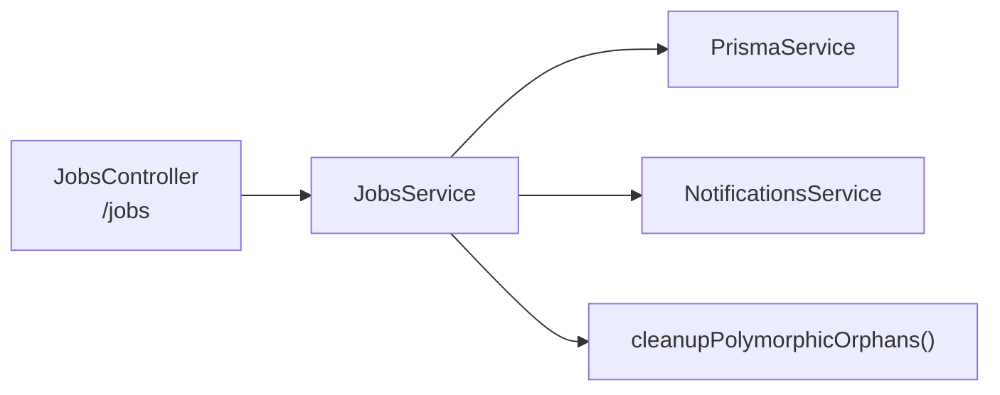
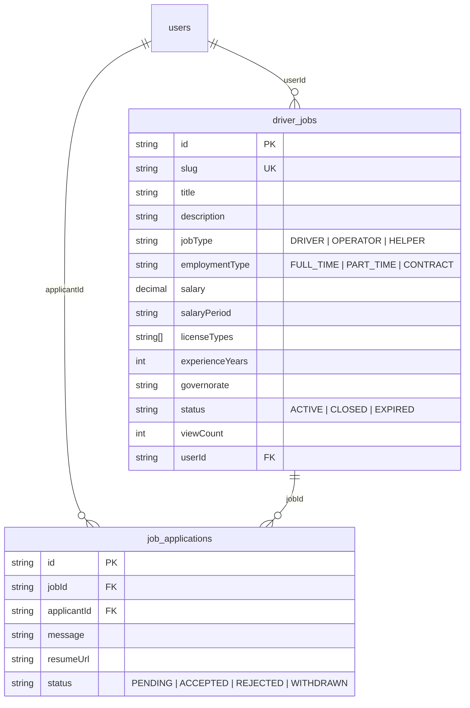

# 💼 تقرير مراجعة — Jobs & Drivers Module

**النطاق:** Driver Jobs · Job Applications · Application Status Management

> **آخر تحديث:** 10/10 issues fixed ✅ — ALL DONE

---

# 1. ARCHITECTURE

**DB Models:** `DriverJob`, `JobApplication`

---

# 2. BACKEND ANALYSIS

## 2.1 Jobs Controller (`/jobs`) — 8 endpoints

| Method | Route | Auth | الوصف |
|--------|-------|:----:|-------|
| POST | `/jobs` | ✅ | إنشاء وظيفة |
| GET | `/jobs` | ❌ | تصفح الوظائف (paginated + filtered) |
| GET | `/jobs/my` | ✅ | وظائفي |
| GET | `/jobs/:id` | ❌ | تفاصيل وظيفة |
| PATCH | `/jobs/:id` | ✅ | تحديث (owner) |
| DELETE | `/jobs/:id` | ✅ | حذف (owner) |
| POST | `/jobs/:id/apply` | ✅ | التقديم على وظيفة |
| GET | `/jobs/:id/applications` | ✅ | عرض الطلبات (owner) |
| PATCH | `/jobs/applications/:id` | ✅ | تغيير حالة طلب (ACCEPTED/REJECTED) |

## 2.2 Service Layer Analysis

| الجانب | التقييم |
|--------|---------|
| **Repository Layer** | ❌ Direct Prisma |
| **Redis Cache** | ✅ Added 5min TTL |
| **Meilisearch** | ❌ لا يوجد — يستخدم `ILIKE` |
| **State Machine** | ✅ Added validation for ACCEPTED/REJECTED transitions |
| **Pagination** | ✅ `findAll()` مع page + limit |
| **Authorization** | ✅ owner check لـ update/delete/view applications |
| **Duplicate prevention** | ✅ `@@unique([jobId, applicantId])` |
| **Self-apply check** | ✅ يمنع المالك من التقديم على وظيفته |
| **Notifications** | ✅ إشعار لصاحب الوظيفة عند التقديم + للمتقدم عند القبول/الرفض |
| **Orphan cleanup** | ✅ `cleanupPolymorphicOrphans('JOB', id)` عند الحذف |

## 2.3 Filters & Sorting

| Filter | الحقل | النوع |
|--------|-------|-------|
| `search` | title, description | `ILIKE` |
| `jobType` | exact match | |
| `employmentType` | exact match | |
| `governorate` | exact match | |
| `licenseType` | `has` (array) | |
| `sortBy` | createdAt, salary, experienceYears, viewCount | |
| `sortOrder` | asc/desc | |

---

# 3. DATABASE MODELS

---

# 4. FRONTEND FILES

| File | الوصف |
|------|-------|
| `app/[locale]/jobs/page.tsx` | قائمة الوظائف |
| `app/[locale]/jobs/[id]/page.tsx` | تفاصيل وظيفة |
| `app/[locale]/jobs/my/page.tsx` | وظائفي |
| `app/[locale]/jobs/new/page.tsx` | إنشاء وظيفة |
| `app/[locale]/add-listing/job/page.tsx` | إضافة وظيفة (بديل) |
| `features/jobs/` | مكونات الوظائف |

---

# 5. ISSUES DETECTION

## 🔴 Critical

| # | المشكلة | الموقع | التفاصيل |
|---|---------|--------|----------|
| J1 | ~~**viewCount manipulation**~~ | `jobs.service.ts` | ✅ **FIXED** — Redis rate-limit per IP (1h cooldown) via `incrementViewCount()` |
| J2 | ~~**No status transition validation**~~ | `jobs.service.ts` | ✅ **FIXED** — State machine: PENDING→ACCEPTED/REJECTED only |
| J3 | ~~**myJobs() without pagination**~~ | `jobs.service.ts` | ✅ **FIXED** — `myJobs(userId, page, limit)` with skip/take |

## 🟡 Medium

| # | المشكلة | الموقع | التفاصيل |
|---|---------|--------|----------|
| J4 | ~~**No Meilisearch**~~ | `jobs.service.ts` | ✅ **FIXED** — Added `jobs` index to SearchService + sync on CUD |
| J5 | ~~**No Redis cache**~~ | `jobs.service.ts` | ✅ **FIXED** — findAll cached 5min, findOne cached 10min, invalidated on CUD |
| J6 | ~~**Duplicated slugify()**~~ | `jobs.service.ts` | ✅ **FIXED** — uses shared `generateSlug()` from `entity.utils.ts` |
| J7 | ~~**Manual field mapping**~~ | `jobs.service.ts` | ✅ **FIXED** — Safe loop over `Object.entries(dto)` with Decimal handling |
| J8 | ~~**resumeUrl not validated**~~ | `apply-job.dto.ts` | ✅ **FIXED** — `@IsUrl()` + `@MaxLength(1000)` for message |

## 🟢 Low

| # | المشكلة | التفاصيل |
|---|---------|----------|
| J9 | ~~No job expiry cron~~ | ✅ **FIXED** — `JobExpiryService` @Cron daily at 4AM, expires after 30 days |
| J10 | ~~No application withdrawal~~ | ✅ **FIXED** — `POST /jobs/applications/:id/withdraw` + `WITHDRAWN` enum |

---

# 6. PRIORITY FIX PLAN

| Priority | # | الإصلاح | الجهد |
|----------|---|---------|-------|
| 🔴 | 1 | **Application status state machine** — PENDING→ACCEPTED/REJECTED only | 1h |
| 🔴 | 2 | **viewCount rate-limit** — Redis INCR per IP+jobId | 2h |
| 🔴 | 3 | **Add pagination to myJobs()** | 15min |
| 🟡 | 4 | Add Meilisearch index for jobs | 3h |
| 🟡 | 5 | Add Redis cache (5min TTL) | 2h |
| 🟢 | 6 | Job expiry cron (30 days) | 1h |
| 🟢 | 7 | Application withdrawal endpoint | 1h |

---

# 7. FIX IMPLEMENTATION SUMMARY

**Result: 10/10 Fixed ✅ — ALL DONE**

| File | Change |
|------|--------|
| `jobs.service.ts` | +RedisService, +SearchService, +generateSlug, +incrementViewCount, state machine, safe update, cache, Meilisearch sync, withdrawApplication |
| `jobs.controller.ts` | +req.ip to findOne, +pagination to myJobs, +withdraw endpoint |
| `jobs.module.ts` | +RedisModule, +SearchModule, +JobExpiryService |
| `job-expiry.service.ts` | **NEW** — Cron job expires old jobs after 30 days |
| `apply-job.dto.ts` | +@IsUrl() for resumeUrl, +@MaxLength(1000) for message |
| `search.service.ts` | +JOBS index with searchable/filterable/sortable attributes |
| `schema.prisma` | +WITHDRAWN to ApplicationStatus enum |
| `app.module.ts` | +ScheduleModule.forRoot() |

---

# 8. POSITIVE FINDINGS ✅

- **Unique constraint** على `jobId_applicantId` — يمنع التكرار
- **Self-apply prevention** — المالك لا يقدر يقدم على وظيفته
- **Notification on application** — صاحب الوظيفة يتلقى إشعار
- **Notification on status change** — المتقدم يتلقى إشعار عند القبول/الرفض
- **Orphan cleanup** — محادثات ومفضلات تُحذف مع الوظيفة
- **Sorting options** — 4 حقول مع asc/desc
