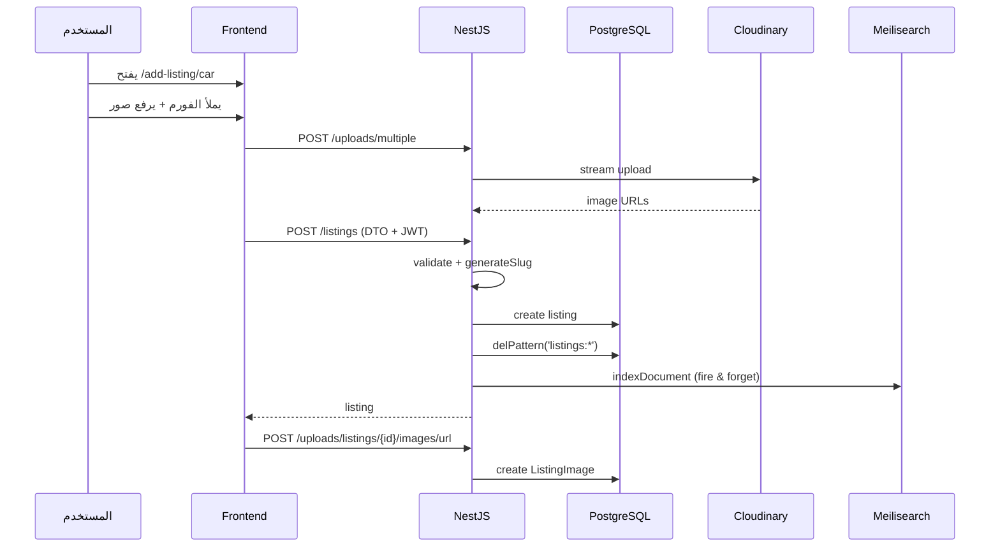
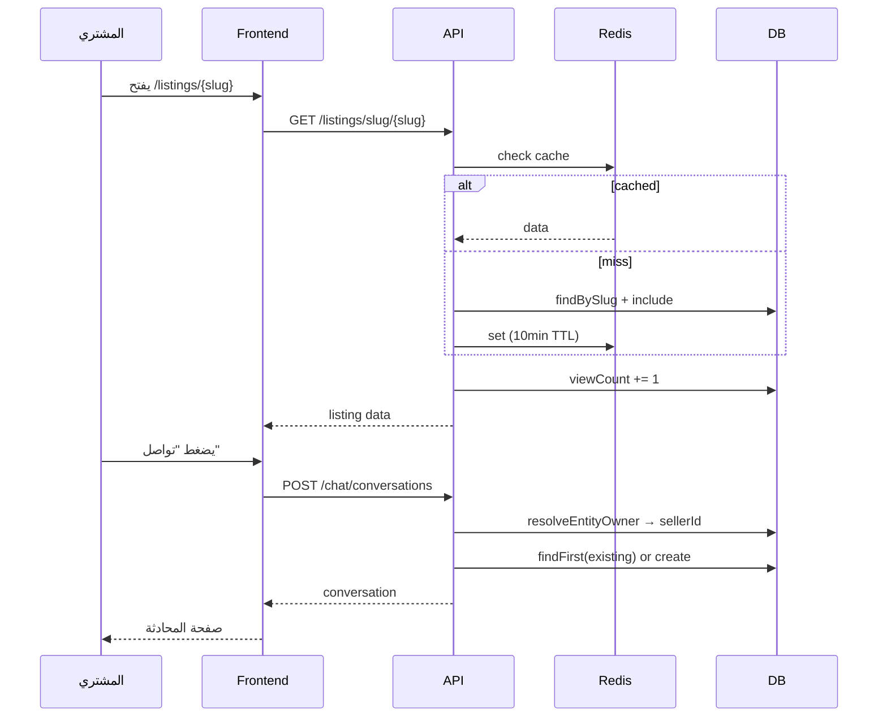
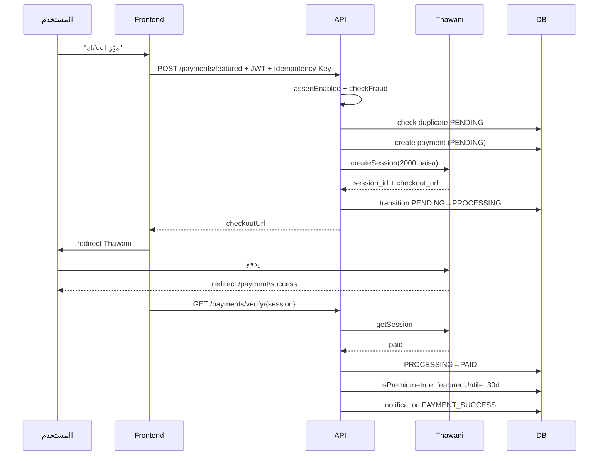
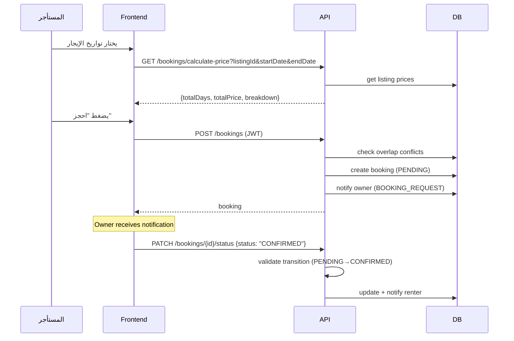
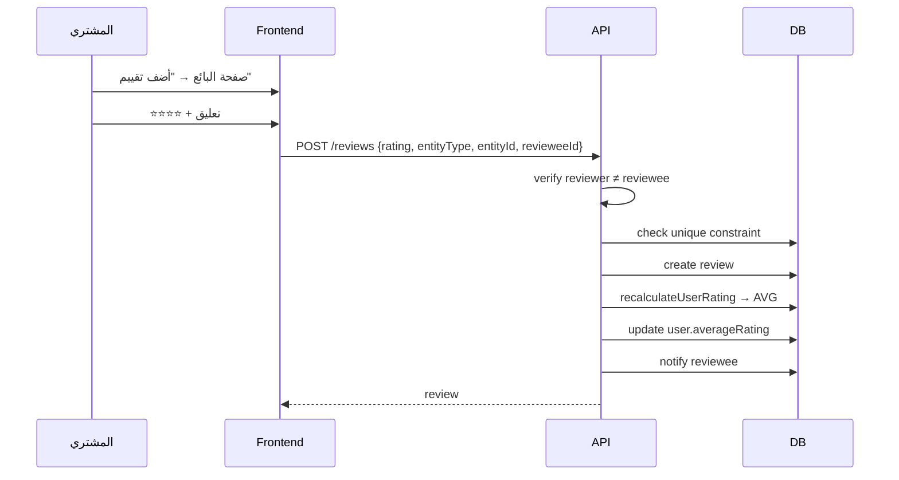

# 🔍 تقرير المراجعة التقنية — الجزء الثاني

(تكملة من AUDIT_REPORT.md)

---

# 9. USER FLOWS (E2E)

## 9.1 Create Ad Flow



## 9.2 View Ad + Start Chat Flow



## 9.3 Payment Flow



## 9.4 Booking Flow (Renting)



## 9.5 Rating Flow



---

# 10. ISSUES DETECTION

## 10.1 🔴 Security Issues

| # | المشكلة | الموقع | التفاصيل |
|---|---------|--------|----------|
| S1 | **viewCount manipulation** | listings, parts, equipment services | يزيد مع كل GET بدون rate-limit — DDoS vector |
| S2 | **No review verification** | `reviews.service.ts` | أي مستخدم يقيّم أي بائع حتى لو لم يتعامل معه — fake reviews |
| S3 | **Webhook secret optional** | `payments.controller.ts:68` | إذا `THAWANI_WEBHOOK_SECRET` فارغ، أي request يمر |
| S4 | **Direct Prisma in Gateway** | `chat.gateway.ts:105` | `this.chatService['prisma']` يكسر encapsulation |
| S5 | **No input sanitization** | Chat messages, review comments | XSS ممكن عند العرض |

## 10.2 🟡 Performance Issues

| # | المشكلة | الموقع | التفاصيل |
|---|---------|--------|----------|
| P1 | **N+1 unread count** | `chat.service.ts` | `Promise.all(map(async => count))` — query لكل محادثة |
| P2 | **No cache: Parts** | `parts.service.ts` | DB مباشرة بدون Redis |
| P3 | **No cache: Equipment** | `equipment-listings.service.ts` | نفس المشكلة |
| P4 | **No pagination: myParts()** | `parts.service.ts` | يرجع كل القطع بدون limit |
| P5 | **No pagination: equipment my()** | `equipment-listings.service.ts` | نفس المشكلة |
| P6 | **Large cache invalidation** | `listings.service.ts` | `delPattern('listings:*')` يحذف كل الـ cache |

## 10.3 🟢 Code Quality Issues

| # | المشكلة | الموقع |
|---|---------|--------|
| CS1 | Duplicated `generateSlug()` | 3+ services |
| CS2 | Inconsistent Repository pattern | Listings ✅ vs rest ❌ |
| CS3 | Fat ChatService (406 lines) | chat.service.ts |
| CS4 | Manual field mapping in updates | listings + parts (40+ lines each) |
| CS5 | JwtPayload redefined locally | 2+ controllers |
| CS6 | Backward compat columns | conversations.listingId, favorites.listingId |
| CS7 | 6 identical image tables | يمكن توحيدها |

## 10.4 Scalability Concerns

| المشكلة | التفاصيل |
|---------|----------|
| Single DB | لا يوجد read replicas |
| viewCount in DB | كل view = write query |
| No Meilisearch for Equipment | `ILIKE` queries فقط |
| Bull single worker | Webhook processing |

---

# 11. PRIORITY FIX PLAN

## 🔴 Critical — يجب الإصلاح فوراً

| # | المشكلة | الإصلاح | الجهد |
|---|---------|---------|-------|
| 1 | **Review verification** | إضافة check: هل المستخدم له booking/payment مع البائع | 4h |
| 2 | **viewCount rate-limit** | Redis INCR per (IP + entityId) — sync to DB كل 5 دقائق | 4h |
| 3 | **Webhook secret enforcement** | تغيير `if (!expectedSecret) throw` — يرفض إذا غير معرّف | 15min |
| 4 | **N+1 unread count** | استبدال بـ single `groupBy` query أو raw SQL subquery | 3h |
| 5 | **Missing pagination** | إضافة page + limit لـ `myParts()` و equipment `my()` | 1h |

## 🟡 Important — السبرنت القادم

| # | المشكلة | الإصلاح | الجهد |
|---|---------|---------|-------|
| 6 | Redis cache for Parts | نفس pattern الـ Listings | 2h |
| 7 | Redis cache for Equipment | نفس الأعلى | 2h |
| 8 | Meilisearch for Equipment | إضافة `equipment` index | 3h |
| 9 | Extract shared utils | `generateSlug()` + `USER_SELECT` | 1h |
| 10 | Fix Gateway Prisma access | استخدام service method | 30min |
| 11 | Conversation duplicate prevention | DB unique constraint أو transaction | 2h |
| 12 | Input sanitization | sanitize-html قبل التخزين | 2h |

## 🟢 Nice to Have — مستقبلي

| # | المشكلة | الإصلاح | الجهد |
|---|---------|---------|-------|
| 13 | API versioning | `/api/v1/` prefix | 2h |
| 14 | Repository for all services | Create repos for Parts, Equipment, Chat, Reviews | 8h |
| 15 | Global exception filter | Consistent error shape + logging | 3h |
| 16 | Composite DB indexes | conversations, messages | 2h |
| 17 | Polymorphic image table | توحيد 6 tables في واحدة | 6h |

---

# 12. QUICK WINS

تحسينات سريعة بأقل جهد وأعلى تأثير:

| # | الـ Quick Win | الجهد | التأثير | الملف |
|---|-------------|-------|---------|-------|
| 1 | **Enforce webhook secret** — سطر واحد | 5min | 🔴 Security | `payments.controller.ts:68` |
| 2 | **Add pagination to myParts/equipment** | 30min | 🟡 Performance | `parts.service.ts`, `equipment-listings.service.ts` |
| 3 | **Import JwtPayload from auth.types** | 10min | 🟢 Consistency | `payments.controller.ts`, `reviews.controller.ts` |
| 4 | **Extract generateSlug to shared** | 30min | 🟢 DRY | Create `src/common/utils/slug.ts` |
| 5 | **Extract USER_SELECT to shared** | 15min | 🟢 DRY | Create `src/common/constants/selects.ts` |
| 6 | **Add `isVerifiedBuyer` check in reviews** | 1h | 🔴 Security | `reviews.service.ts` |
| 7 | **Fix Gateway → use service method** | 15min | 🟡 Architecture | `chat.gateway.ts:105` |
| 8 | **Add TTL-based viewCount** | 2h | 🟡 Security | Redis `INCR` per IP+entity |

---

# 13. REFACTORING SUGGESTIONS

## 13.1 Architecture Improvements

### 1. Unified Repository Layer
**الحالة:** Listings و Bookings فقط لديهم repository.
**التوصية:** إنشاء repository لكل service:
```
src/common/base.repository.ts  → Generic CRUD
src/parts/parts.repository.ts
src/equipment/equipment.repository.ts
src/chat/chat.repository.ts
src/reviews/reviews.repository.ts
```
**الفائدة:** easier testing, DB abstraction, consistent patterns.

### 2. Shared Utilities Module
```
src/common/
├── utils/
│   ├── slug.ts              → generateSlug()
│   ├── pagination.ts        → paginate() helper
│   └── sanitize.ts          → sanitizeInput()
├── constants/
│   ├── selects.ts           → USER_SELECT, SELLER_SELECT
│   └── limits.ts            → pagination defaults
├── decorators/
│   └── current-user.ts      → ✅ already exists
└── filters/
    └── global-exception.ts  → custom exception filter
```

### 3. Split ChatService
```
src/chat/
├── chat.service.ts           → facade (delegates)
├── conversation.service.ts   → create, get, archive
├── message.service.ts        → send, delete, search
├── reaction.service.ts       → toggle reaction
└── presence.service.ts       → online status (moved from gateway)
```

### 4. Polymorphic Image Table
بدل 6 tables (`listing_images`, `spare_part_images`, `equipment_listing_images`, `bus_listing_images`, `car_service_images`, `transport_images`):
```prisma
model Image {
  id          String    @id @default(cuid())
  url         String
  isPrimary   Boolean   @default(false)
  order       Int       @default(0)
  entityType  String    // LISTING, SPARE_PART, EQUIPMENT, etc.
  entityId    String
  createdAt   DateTime  @default(now())

  @@index([entityType, entityId])
  @@map("images")
}
```
**ملاحظة:** يحتاج migration plan + backward compat.

### 5. viewCount via Redis + Cron Sync
```
GET /listings/:id → Redis INCR view:{entityType}:{entityId} (TTL 24h per IP)
Cron (every 5min) → batch UPDATE from Redis to DB
```

## 13.2 Folder Structure Improvement

**الحالة الحالية:**
```
src/listings/
├── listings.controller.ts
├── listings.service.ts
├── listings.repository.ts
├── listings.module.ts
└── dto/
```

**التوصية — Per-Module Structure:**
```
src/listings/
├── listings.module.ts
├── api/
│   ├── listings.controller.ts
│   └── dto/
├── domain/
│   ├── listings.service.ts
│   └── interfaces/
└── infra/
    ├── listings.repository.ts
    └── listings.cache.ts
```

## 13.3 Test Coverage Improvement

**الحالة الحالية:**
- ✅ `payments.service.spec.ts` — 35 test cases
- ✅ `auth.service.spec.ts` — existing
- ❌ لا يوجد tests لـ: Listings, Parts, Equipment, Bookings, Chat, Reviews

**التوصية:**
| Module | Priority | Key Tests |
|--------|----------|-----------|
| Bookings | 🔴 High | State transitions, conflict detection, price calculation |
| Reviews | 🔴 High | Verification, duplicate prevention, rating calculation |
| Listings | 🟡 Medium | CRUD, authorization, cache invalidation |
| Chat | 🟡 Medium | Conversation creation, message flow, participant checks |
| Equipment Bids | 🟡 Medium | Rate limiting, acceptance cascade, withdrawal cooldown |

---

# ✅ SUMMARY

## نقاط القوة
1. **Payment system mature** — state machine + fraud detection + DLQ + idempotency
2. **Polymorphic chat** — يدعم 10 أنواع كيانات
3. **Meilisearch integration** — بحث سريع مع Arabic synonyms و typo tolerance
4. **Booking state machine** — valid transitions مع notifications
5. **Redis rate limiting** — bids per day + withdrawal cooldown
6. **DTO validation** — class-validator مع رسائل عربية

## أكبر 5 مخاطر
1. 🔴 **Fake reviews** — لا يوجد verification أن المستخدم فعلاً تعامل مع البائع
2. 🔴 **viewCount manipulation** — يمكن تضخيمه بسهولة
3. 🔴 **N+1 queries** — في Chat unread count
4. 🟡 **Missing caching** — Parts + Equipment بدون Redis
5. 🟡 **Missing Meilisearch** — Equipment search بدون full-text

## الجهد الإجمالي المطلوب
| الأولوية | عدد العناصر | الجهد الإجمالي |
|----------|:-----------:|:--------------:|
| 🔴 Critical | 5 | ~12 hours |
| 🟡 Important | 7 | ~14 hours |
| 🟢 Nice to have | 5 | ~21 hours |
| **المجموع** | **17** | **~47 hours** |

---

**نهاية التقرير**
