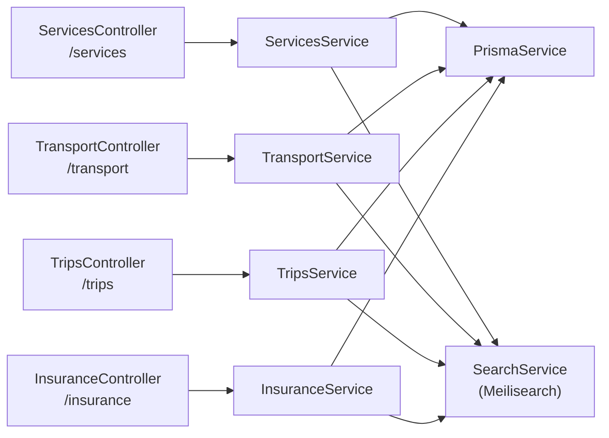
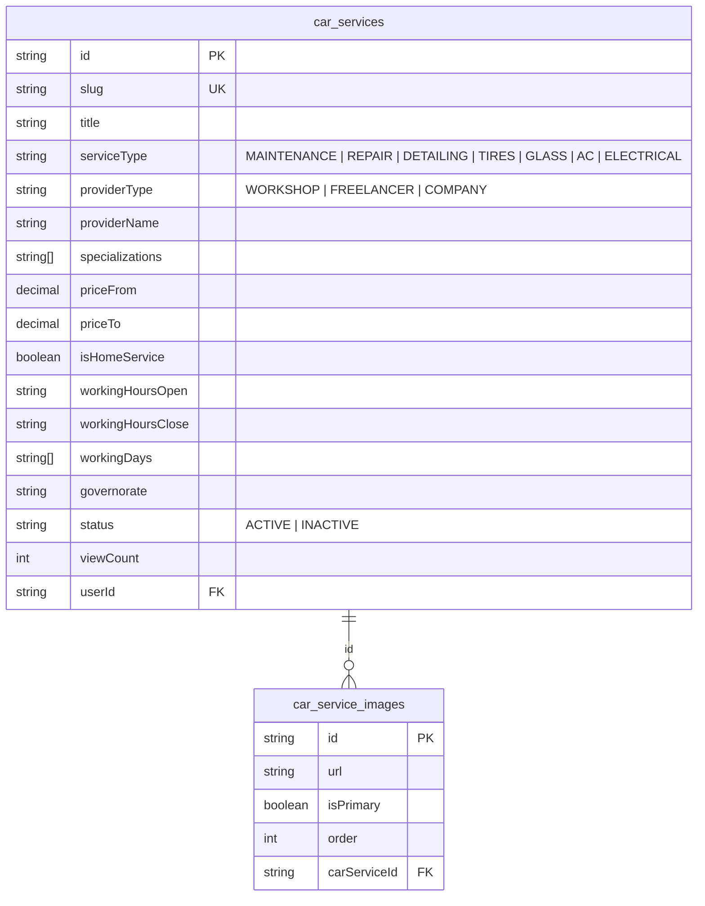
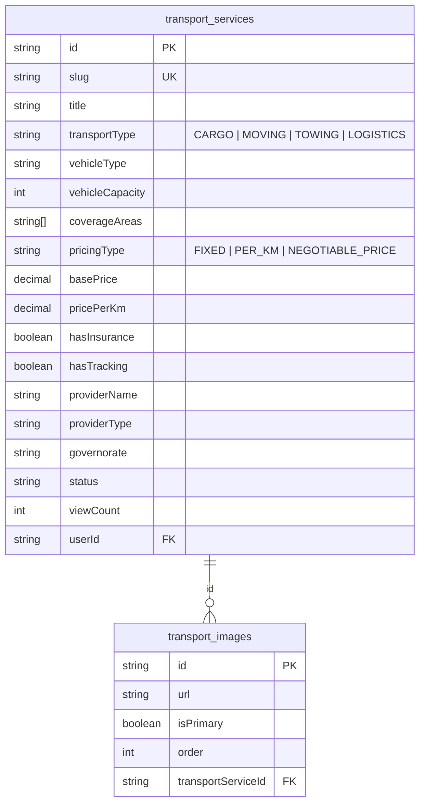
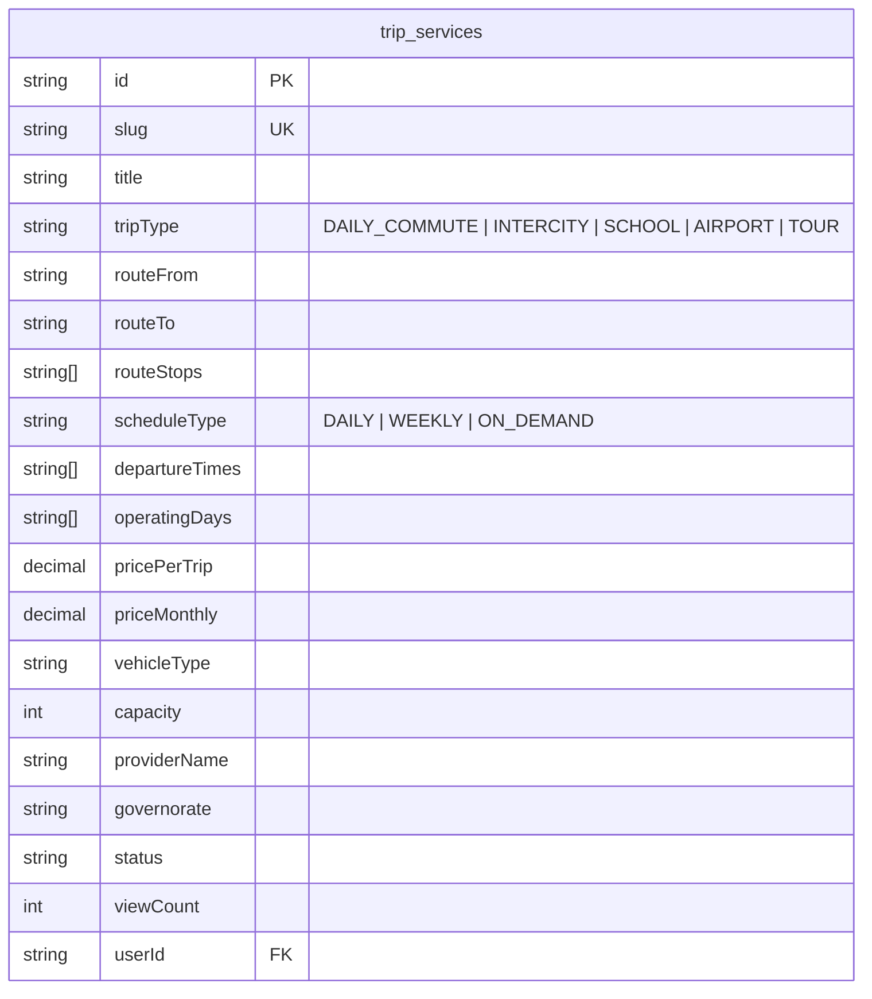
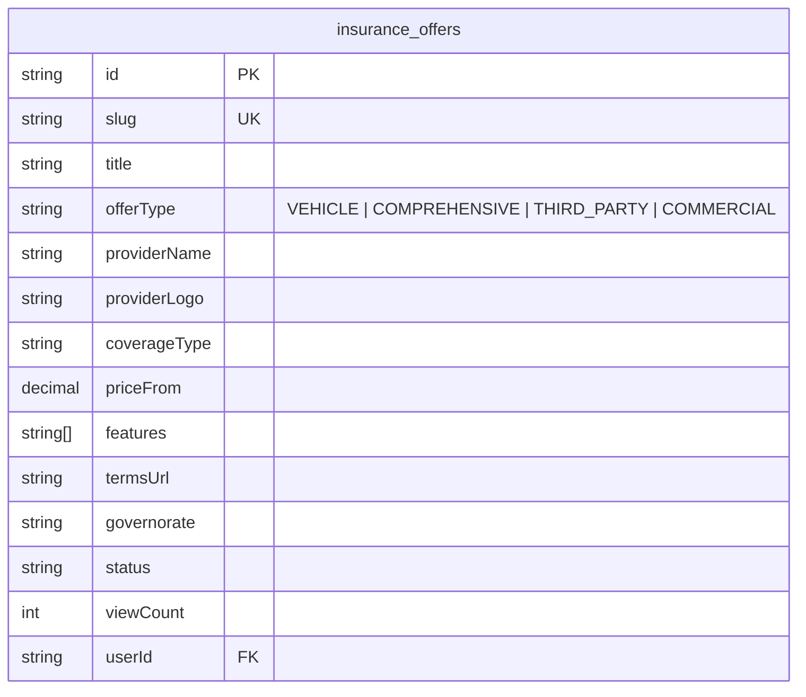

# 🔧 تقرير مراجعة — Car Services · Transport · Trips · Insurance

**النطاق:** 4 Marketplace modules — خدمات سيارات · نقل ولوجستيك · رحلات · تأمين

---

# 1. ARCHITECTURE

هذه الموديولات الأربع متشابهة جداً في البنية — نفس الـ pattern مع اختلاف الحقول فقط:



**Key Pattern:** كل module يعمل: CRUD + Meilisearch sync + generateSlug + viewCount.

---

# 2. BACKEND ANALYSIS

## 2.1 Endpoints Pattern (متطابق في الأربع)

كل module له نفس الـ 7 endpoints:

| Method | Route | Auth | الوصف |
|--------|-------|:----:|-------|
| POST | `/{module}` | ✅ | إنشاء |
| GET | `/{module}` | ❌ | تصفح (paginated + filtered) |
| GET | `/{module}/my` | ✅ | إعلاناتي |
| GET | `/{module}/slug/:slug` | ❌ | بالـ slug |
| GET | `/{module}/:id` | ❌ | تفاصيل |
| PATCH | `/{module}/:id` | ✅ | تحديث (owner) |
| DELETE | `/{module}/:id` | ✅ | حذف (owner) |

| Module | Controller Path | DB Table | Meilisearch Index |
|--------|----------------|----------|-------------------|
| Car Services | `/services` | `car_services` | `services` ✅ |
| Transport | `/transport` | `transport_services` | `transport` ✅ |
| Trips | `/trips` | `trip_services` | `trips` ✅ |
| Insurance | `/insurance` | `insurance_offers` | `insurance` ✅ |

## 2.2 Service Layer Comparison

| الجانب | Services | Transport | Trips | Insurance |
|--------|:-------:|:---------:|:-----:|:---------:|
| Repository | ❌ | ❌ | ❌ | ❌ |
| Redis Cache | ❌ | ❌ | ❌ | ❌ |
| Meilisearch | ✅ | ✅ | ✅ | ✅ |
| Notifications | ❌ | ❌ | ❌ | ❌ |
| Pagination | ✅ | ✅ | ✅ | ✅ |
| Authorization | ✅ | ✅ | ✅ | ✅ |
| Orphan cleanup | ✅ | ✅ | ✅ | ✅ |
| Search sync on CRUD | ✅ | ✅ | ✅ | ✅ |
| Slug generation | ✅ | ✅ | ✅ | ✅ |
| Image support | ✅ images table | ✅ images table | ❌ no images | ❌ no images |

---

# 3. DATABASE MODELS

## 3.1 Car Services



## 3.2 Transport



## 3.3 Trips



## 3.4 Insurance



---

# 4. FRONTEND FILES

| Module | Page | File |
|--------|------|------|
| Services | قائمة | `app/[locale]/services/page.tsx` |
| Services | تفاصيل | `app/[locale]/services/[id]/page.tsx` |
| Services | إضافة | `app/[locale]/add-listing/service/page.tsx` |
| Transport | قائمة | `app/[locale]/transport/page.tsx` |
| Transport | تفاصيل | `app/[locale]/transport/[id]/page.tsx` |
| Transport | إضافة | `app/[locale]/add-listing/transport/page.tsx` |
| Trips | قائمة | `app/[locale]/trips/page.tsx` |
| Trips | تفاصيل | `app/[locale]/trips/[id]/page.tsx` |
| Trips | إضافة | `app/[locale]/add-listing/trip/page.tsx` |
| Insurance | قائمة | `app/[locale]/insurance/page.tsx` |
| Insurance | تفاصيل | `app/[locale]/insurance/[id]/page.tsx` |
| Insurance | إضافة | `app/[locale]/add-listing/insurance/page.tsx` |

---

# 5. ISSUES DETECTION & STATUS

## 🔴 Critical

| # | المشكلة | الحالة | التفاصيل |
|---|---------|--------|----------|
| SV1 | **viewCount manipulation** | ✅ Fixed | Redis rate-limit per IP (1h cooldown) via `view-count.helper.ts` |
| SV2 | **myServices() without pagination** | ✅ Fixed | `myListings(userId, page, limit)` في BaseListingService |

## 🟡 Medium

| # | المشكلة | الحالة | التفاصيل |
|---|---------|--------|----------|
| SV3 | **No Redis cache** | ✅ Fixed | findAll cached 5min, findOne cached 10min, invalidated on CUD |
| SV4 | **4 copies of generateSlug()** | ✅ Fixed | Shared `entity.utils.ts` — يدعم عربي |
| SV5 | **No UpdateDto** | ✅ Fixed | Safe mapping via `decimalFields`/`dateFields` config in Base |
| SV6 | **Manual field mapping in update()** | ✅ Fixed | BaseListingService handles Decimal/Date conversion safely |
| SV7 | **No notifications** | ✅ Fixed | Event-driven: listing.created/updated/deleted/status_changed → in-app + Push |
| SV8 | **Trips/Insurance without images** | ✅ Fixed | TripImage + InsuranceImage models, upload routes, gallery in detail pages |

## 🟢 Low / Code Smell

| # | المشكلة | الحالة | التفاصيل |
|---|---------|--------|----------|
| SV9 | **4 identical service structures** | ✅ Fixed | `BaseListingService` — ~700 LOC → ~250 LOC |
| SV10 | **Search sync inconsistency** | ✅ Fixed | `buildMeiliDoc()` consistent, `imageUrl: null` for Trips/Insurance |
| SV11 | **No status management** | ✅ Fixed | `PATCH /{module}/:id/status` — toggles ACTIVE ↔ INACTIVE |

**Result: 11/11 Fixed ✅ · 0 Deferred**

---

# 6. IMPLEMENTATION SUMMARY

## 6.1 New Files

| File | Purpose |
|------|---------|
| `common/services/base-listing.service.ts` | Abstract base — CRUD, cache, viewCount, status toggle |
| `common/utils/view-count.helper.ts` | Redis rate-limited view counter |
| `common/events/listing.events.ts` | Event types + payloads |
| `common/listeners/listing-notification.listener.ts` | Event → Notification (in-app + push) |
| `services/services.service.spec.ts` | 16 test cases |
| `transport/transport.service.spec.ts` | 4 test cases |
| `trips/trips.service.spec.ts` | 3 test cases |
| `insurance/insurance.service.spec.ts` | 3 test cases |

## 6.2 Refactored Files

| File | Change |
|------|--------|
| `services/services.service.ts` | extends BaseListingService (176→78 lines) |
| `transport/transport.service.ts` | extends BaseListingService (175→76 lines) |
| `trips/trips.service.ts` | extends BaseListingService (183→96 lines) |
| `insurance/insurance.service.ts` | extends BaseListingService (164→81 lines) |
| `services/services.controller.ts` | +slug, +status toggle, +IP, +pagination |
| `transport/transport.controller.ts` | +slug, +status toggle, +IP, +pagination |
| `trips/trips.controller.ts` | +slug, +status toggle, +IP, +pagination |
| `insurance/insurance.controller.ts` | +slug, +status toggle, +IP, +pagination |

## 6.3 New API Endpoints (per module)

| Method | Route | Auth | الوصف |
|--------|-------|:----:|-------|
| GET | `/{module}/slug/:slug` | ❌ | بحث بالـ slug (rate-limited viewCount) |
| PATCH | `/{module}/:id/status` | ✅ | تبديل الحالة ACTIVE ↔ INACTIVE |

## 6.4 Test Results

```
Test Suites: 4 passed, 4 total
Tests:       30 passed, 30 total
```

---

# 7. BaseListingService Architecture (Implemented ✅)

```
BaseListingService (abstract)
├── create()         → buildCreateData() + Meilisearch sync + cache invalidation
├── findAll()        → buildWhereFilter() + Redis cache (5min TTL)
├── findOne()        → Redis cache (10min) + rate-limited viewCount
├── findBySlug()     → same as findOne but by slug
├── myListings()     → paginated (page, limit)
├── update()         → safe Decimal/Date mapping via config + Meilisearch sync
├── remove()         → orphan cleanup + Meilisearch remove + cache invalidation
└── toggleStatus()   → ACTIVE ↔ INACTIVE + Meilisearch sync

Subclass only implements:
├── config            → modelName, meiliIndex, entityType, decimalFields, dateFields
├── buildCreateData() → DTO → Prisma data mapping
├── buildMeiliDoc()   → record → search document
├── buildWhereFilter()→ query DTO → Prisma where clause
└── getXxxInclude()   → optional override for Prisma includes
```

---

# 8. POSITIVE FINDINGS ✅

- **Meilisearch integration** — كل الأربع modules متزامنة مع Meilisearch (عكس Buses/Equipment)
- **Fire-and-forget search sync** — `.catch(() => {})` لا يوقف الـ response
- **Orphan cleanup** — عند حذف أي كيان
- **Remove from Meilisearch on delete** — تنظيف الـ index عند الحذف
- **Rich data models** — حقول متخصصة لكل نوع (routes لـ trips, coverage لـ transport, etc.)
- **Decimal handling** — `Prisma.Decimal` للأسعار — ✅ دقيق
- **BaseListingService** — ~700 LOC duplicated → ~250 LOC shared ✅
- **Redis caching** — findAll + findOne مع auto-invalidation ✅
- **viewCount rate-limit** — Redis-backed per IP (1h cooldown) ✅
- **30 tests passing** — coverage across all 4 modules + event emission ✅
- **Event-driven notifications** — decoupled via `@nestjs/event-emitter` ✅
